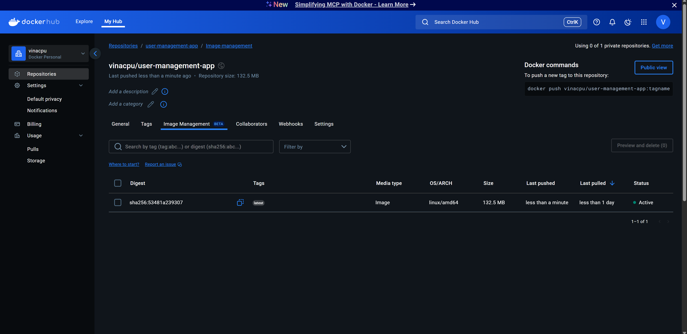

# Homework 10: User Management

Docker Image PNG:

# Issues Fixed: 

https://github.com/vina-cpu/event_manager_1/issues/1

https://github.com/vina-cpu/event_manager_1/issues/2 - This is the most important one, as this one I ended up coming across the user and password errors.

https://github.com/vina-cpu/event_manager_1/issues/3

https://github.com/vina-cpu/event_manager_1/issues/4

https://github.com/vina-cpu/event_manager_1/issues/5

https://github.com/vina-cpu/event_manager_1/issues/6

https://github.com/vina-cpu/event_manager_1/issues/7

https://github.com/vina-cpu/event_manager_1/issues/8

I found this assignment rather challenging, and learned a lot from it. One soft skill that I helped develop was my actual documentation of issues; something I wish I did better was explore the program a bit more before I just dove in and started testing it. I think I got a bit ahead of myself and just wrote the problems down without actually figuring out why they could be happening first, or separating the issues until later. I think I was more worried about forgetting them than understanding them, and then I could go back and figure out why they were happening when I was exploring each issue on it's own. This seemed like a good idea at first, but it also led me to have 3 issues in that 2nd Issue that I created, and I ended up solving all of those issues at once. I tried to group it by going through the services, seeing what was wrong there, then going to the models and schemas, and finally going through the test_api. I found that one particularly challenging, as it was hard to trace back the specific login issue that was happening, it was just giving me a blanket statement. I think that's why I thought it was only one issue, when it happened to be both the email verification, and the password hashing that was going wrong. I did not even consider that with that one statement both things could be failing. Thinking of all possible explanations, or not just hoping that only one thing is wrong, are things that I can take with me to future projects. Logging what was going wrong was really important!
I also learned a lot about how everything is actually organized! I've always thought of web-based applications as scary because there are so many moving parts (my HTML and CSS and previous web-application development experience is mediocre at best) and these last couple assignments helped me to dive in with what models and schemas and services even are, and how they fit together. How the HTTP protocol works is really interesting, and understanding that first helped me to navigate what was actually going wrong, and seeing those error messages and knowing what it meant was really helpful. I will say something that was a bit stressful was that I walked into the assignment expecting that it would work and I would have to explore some of the things it wasn't doing and try to make the application better by exploring how to make those things, and was a bit surprised when a bunch of tests were failing, but ultimately I am grateful because it did help steer me to see the issues that were mentioned in the instructions, and also guided me to find the solutions to those issues.